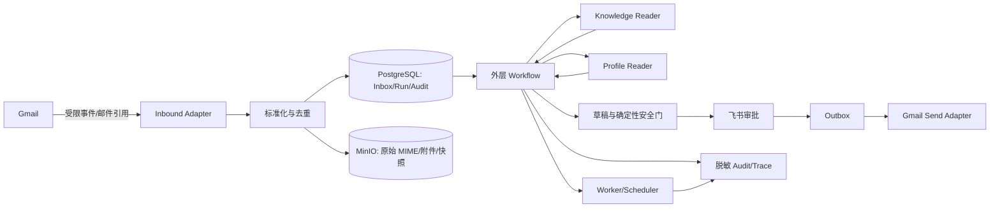

# Step 005：数据分类与威胁模型

> 文档状态：`SECURITY_REVIEW_REQUIRED`
>
> 版本：v0.1；更新时间：2026-09-04
>
> 评审责任人：安全负责人、技术负责人、运维负责人

## 状态与安全目标

本文件定义邮件运营助手处理的数据级别、存储和访问边界，并使用 STRIDE 思路覆盖入站、知识、画像、模型、审批、外发、队列和部署供应链。当前状态是安全评审待完成，不代表已经通过渗透测试或生产合规验收。

安全默认值是最小权限、最小数据、默认拒绝和人工接管。任何无法确认分类、权限、租户、Thread、版本或发送状态的请求，都进入只读/人工处理，不以“方便排错”为理由放宽边界。

## 数据分类

| 分级 | 示例 | 存储 | 访问范围 | 保留策略 | 日志处理 | LLM/Prompt 处理 |
|---|---|---|---|---|---|---|
| `Public` | 已批准的公开产品资料、公开术语和公开帮助内容 | 版本化 Knowledge Store | 仅通过受限检索器读取 | 按知识版本保留，过期版本可归档 | 记录文档/版本 ID，不记录无关原文 | 可提供与当前任务相关的最小片段，保留来源引用 |
| `Internal` | 路由配置、非敏感运行状态、内部 Runbook、聚合指标 | PostgreSQL、配置存储和指标系统 | 组织内最小角色与服务身份 | 按运维和业务需要保留，定期清理 | 不写邮件正文、Token 或合同；指标标签不含正文 | 只在当前任务确有必要时提供规则摘要，禁止整库注入 |
| `Confidential` | 客户邮件正文、Thread 摘要、客户画像、审批草稿、内部知识、审计上下文 | 加密 PostgreSQL 与 MinIO，使用租户/Thread 前缀 | 对应租户、Thread 和角色范围；服务间最小授权 | 按客户数据处理协议和业务策略保留，支持归档/删除 | 只记录脱敏摘要、ID、hash 和引用；禁止完整正文 | 字段级最小化、脱敏和来源绑定；不发送无关邮件或合同全文 |
| `Restricted` | OAuth refresh token、API key、签名密钥、合同/付款/身份证明和 Break-glass 资料 | Docker secrets 或 KMS 兼容密钥存储，受控 Blob | 极少数服务身份；人工 Break-glass 需限时授权 | 按密钥/合规策略轮换和销毁，导出需单独审计 | 绝不进入普通日志、Trace、指标标签、错误消息或快照 | 禁止进入普通 Prompt、模型上下文、检索索引和生成结果 |

### 字段处理规则

1. 字段进入日志、Trace、Prompt、Checkpoint、Outbox 或不可变快照前，必须先完成分级和用途判断。
2. 没有分类、访问范围、保留期限和脱敏策略的字段不得进入任何运行载体。
3. tenant ID、Thread ID、Run ID、Message-ID 和 hash 只用于关联与审计，不能替代资源级授权。
4. 原始 MIME、附件和完整正文使用受控 Blob 引用；Graph/Checkpoint 只保存精简上下文、来源和 URI，不保存无界大对象。
5. 脱敏失败或扫描结果不确定时，阻断 LLM/外发请求并转人工，不把原始值写入错误消息帮助排错。

## 数据流与信任边界

### 信任边界

| 边界 | 不可信输入 | 必须控制 |
|---|---|---|
| Gmail → Inbound | Webhook 事件、邮件正文、HTML、附件元数据 | OAuth/签名校验、事件时间窗、去重、大小/类型检查和租户映射 |
| Inbound → Workflow | 标准化字段、发件人、Thread 和正文引用 | Schema 校验、资源范围、Prompt Injection 标记和状态版本 |
| Knowledge/Profile → Workflow | 检索片段、画像候选和历史摘要 | 来源绑定、只读、租户/Thread 隔离、最小上下文和事实门禁 |
| Workflow → LLM/DeepAgent | 邮件任务、证据片段和策略摘要 | Reader 无副作用工具、字段脱敏、Token 预算、工具 Allowlist 和循环熔断 |
| Workflow → 飞书/Outbox/Gmail | 草稿、审批命令、发送意图和 Message-ID | 权限、审批 hash、策略/控制版本、幂等键、发送前最终门禁 |
| 运维 → 日志/Break-glass | 调试请求、快照和受控字段 | 工单、最小字段、租户范围、时限、审批和导出审计 |

## STRIDE 威胁清单

| ID | 资产/边界 | 威胁 | 控制 | 责任/验证证据 | 安全终态 |
|---|---|---|---|---|---|
| `T-001` | Gmail → Inbound | 伪造事件、重放事件或伪造租户映射 | OAuth/签名校验、事件时间窗、event/message 幂等键和租户映射 | Connector 契约测试、重放测试、`inbound.rejected` 审计 | `REJECTED`，不启动副作用 |
| `T-002` | 租户/Thread 数据 | 跨租户或跨 Thread 读取 | Repository、Graph 和 Tool 层重复执行资源范围校验，错误消息不泄露存在性 | RBAC/ABAC 负向测试、资源范围审计 | `ACCESS_DENIED` + 安全事件 |
| `T-003` | 邮件/知识 → LLM | Prompt Injection 让模型跳过审批、泄露提示或调用工具 | 外部内容标为不可信数据；Reader 无副作用工具；规则优先于内容指令 | 攻击集、工具轨迹、Canary/敏感词扫描 | `QUARANTINED`，不外发 |
| `T-004` | Knowledge/Profile | 长期记忆投毒或把推断写成事实 | 来源、evidence span、置信度、类型化字段、版本和人工纠正；Outbox 写入 | 证据匹配测试、冲突审计、画像版本检查 | 丢弃候选或 `HUMAN_REVIEW` |
| `T-005` | 草稿 → Gmail | 未审批、过期 hash 或权限失效导致外发 | 审批 hash、证据、权限、策略/控制版本和发送前确定性最终门禁 | 未审批/旧版/暂停的负向 UAT 和 Outbox 查询 | `BLOCKED`，写审计 |
| `T-006` | Gmail Adapter | Provider 超时被误判为未发送，造成重复发送 | 稳定 Message-ID、唯一幂等键、Sent/Thread/History 补偿查询 | 超时、进程重启、并发发送测试 | `SEND_UNKNOWN`，禁止盲重试 |
| `T-007` | Follow-up 调度 | 客户回信后旧跟进撞车 | 入站快速失效、调度双检、生成前复查和发送前原子条件更新 | 47h59m59s/48h 并发边界测试、P0 告警 | `INVALIDATED`，违规触发暂停 |
| `T-008` | 附件/Blob → Parser | 恶意文件、SSRF、宏/脚本执行或数据外带 | 类型/大小白名单、病毒扫描、隔离解析、无任意网络/命令执行 | 恶意附件集、SSRF/RCE 负向测试和 Blob ACL 检查 | `QUARANTINED` |
| `T-009` | 日志/Trace/快照 | PII、合同全文或 Token 泄露 | 字段级脱敏、Prompt 最小化、禁止敏感标签、访问审计和保留策略 | 日志/Trace/Prompt 扫描、脱敏阻断 UAT | `REDACTION_BLOCKED` |
| `T-010` | OAuth/KMS | 凭据被窃取、Scope 过宽或离职后仍可用 | 最小 Scope、secret manager、轮换/撤销、代码 allowlist、服务身份隔离 | Scope 审计、密钥轮换和撤销演练 | `REAUTH_REQUIRED` 或暂停连接器 |
| `T-011` | Worker/Queue | 毒消息、无限重试、资源耗尽或租户饥饿 | 超时、指数退避、最大尝试、预算、熔断、DLQ 和租户配额 | 故障注入、重试/资源压测、DLQ 审计 | `DLQ`/人工处理 |
| `T-012` | 依赖/部署供应链 | 恶意依赖、不安全镜像、过宽网络或运行权限 | 锁定依赖、扫描、非 root、网络最小权限、发布门禁和版本记录 | SAST/依赖/镜像扫描、配置检查、回滚演练 | 阻断发布 |

## Break-glass 与默认拒绝

排错人员默认不能从日志还原客户合同、完整邮件或 Restricted 字段。Break-glass 访问必须同时具备：

- incident/ticket ID 和访问理由；
- 明确的授权人和操作者；
- 最小字段集合与明确的租户/Thread 范围；
- 开始时间、结束时间和自动失效时间；
- 查询、导出、查看和撤销的完整审计。

Break-glass 只允许解决指定事件，不得借此扩大普通角色权限、复制原文到聊天工具或把敏感内容写入 Prompt。到期自动撤销；发现范围不符、规则命中或审计缺失时立即终止访问。

以下任何状态无法确认时，系统默认只读/人工处理：数据分类、租户、Thread、身份、权限、OAuth Scope、策略版本、草稿 hash、审批结果、暂停控制、附件扫描结果和发送结果。未知发送结果为 `SEND_UNKNOWN`，未知附件为 `QUARANTINED`，未知权限为 `ACCESS_DENIED` 或 `REAUTH_REQUIRED`。

## 安全评审记录

| 角色 | 姓名 | 结论 | 签字/日期 | 遗留事项 |
|---|---|---|---|---|
| 安全负责人 | 待填写 | 待评审 | 待填写 | 确认分类、STRIDE 控制和攻击集 |
| 技术负责人 | 待填写 | 待评审 | 待填写 | 确认数据流、权限边界和失败终态 |
| 运维负责人 | 待填写 | 待评审 | 待填写 | 确认密钥、Break-glass、备份和恢复审计 |
