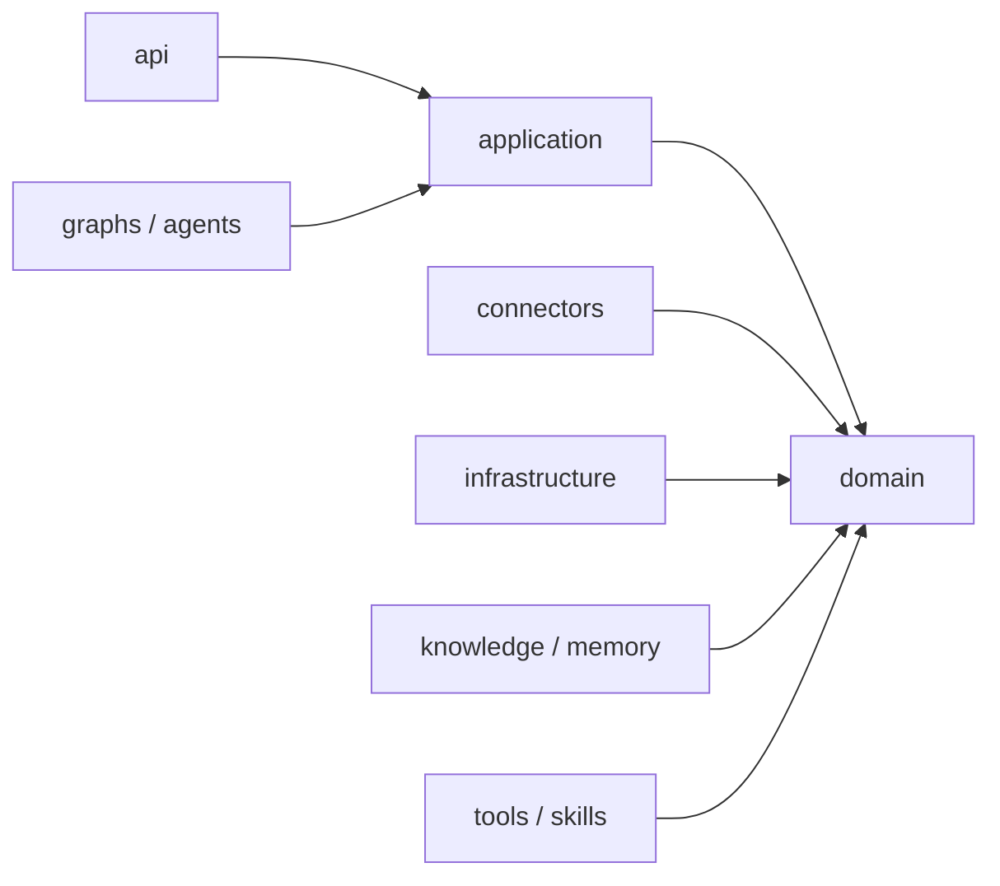

# Step 008：仓库骨架说明

> 文档状态：`SKELETON_REVIEW_REQUIRED`
>
> 版本：v0.1；更新时间：2026-09-07

## 目录职责

| 目录 | 单一职责 |
|---|---|
| `src/ai_ops/api` | FastAPI 控制面和资源级鉴权入口 |
| `src/ai_ops/domain` | 领域模型、业务规则和供应商中立接口 |
| `src/ai_ops/application` | 用例编排和事务边界 |
| `src/ai_ops/graphs` | 外层 LangGraph 状态编排 |
| `src/ai_ops/agents` | 受限 DeepAgent 子图 |
| `src/ai_ops/skills` | Skill 定义和渐进披露元数据 |
| `src/ai_ops/tools` | Tool Allowlist 和调用契约 |
| `src/ai_ops/connectors` | Gmail、飞书、LLM 等外部 Adapter |
| `src/ai_ops/knowledge` | 知识读取、检索和证据绑定 |
| `src/ai_ops/memory` | 客户画像、Profile Delta 和长期记忆接口 |
| `src/ai_ops/infrastructure` | 数据库、队列、Blob、配置和观测实现 |
| `tests/unit` | 领域/应用单元测试 |
| `tests/integration` | 多模块和基础设施集成测试 |
| `tests/contract` | Adapter 与外部协议契约测试 |
| `tests/fixtures` | 脱敏、确定性的测试数据说明和夹具 |
| `deploy` | Docker Compose、迁移和部署材料 |

## 依赖方向

依赖方向由外向内，领域层不依赖 LangGraph、Gmail SDK、LLM SDK、数据库或队列：



Graph 节点只能消费 `ai_ops.domain.interfaces` 等稳定接口；Gmail SDK 调用必须隔离在 `connectors` 实现中。替换 Gmail 或 LLM 实现时，只增加/替换 Connector 和契约测试，不修改领域模型。

## 当前范围与检查

Step 008 只建立包入口、Provider Protocol、测试目录和静态边界检查，不接入 Gmail、飞书、LLM、数据库或业务流程。运行：

```powershell
$env:PYTHONPATH = (Join-Path (Resolve-Path '.') 'src')
uv run pytest tests/contract/test_provider_interfaces.py -q
python scripts/check_skeleton.py
```

骨架检查成功时输出 `SKELETON_CHECK_PASS`。真实 Provider 实现必须在后续步骤通过独立契约、权限和安全评审。
