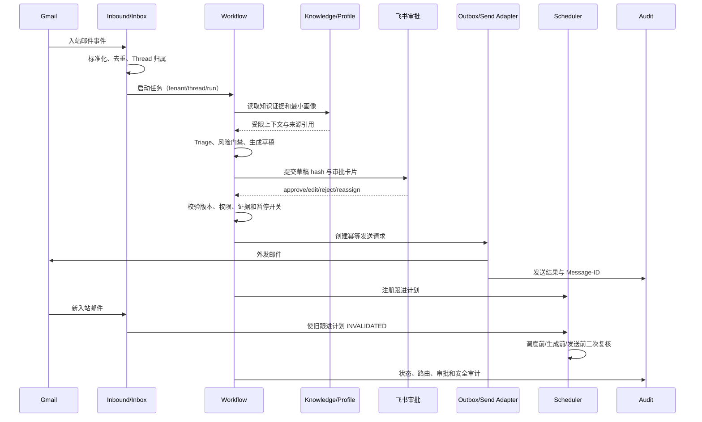
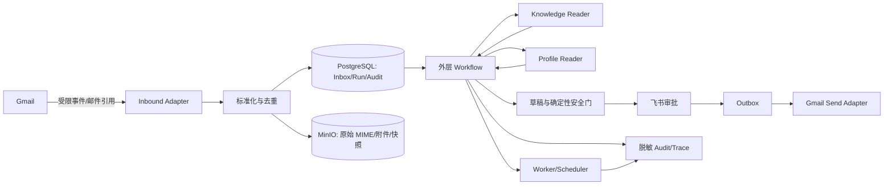

# 企业级邮件运营助手 Step 1–5 设计规格

> 版本：v0.1
>
> 状态：待用户评审
>
> 适用范围：企业级 AI 邮件运营助手 Level 0，实施路线图 Step 001–005

## 1. 目标与约束

本设计将 Step 001–005 固化为可以评审、签字、回放和执行的项目基线。交付物是五份 Markdown 规格文档及其索引，不提前创建运行时代码，不宣称 Gmail、飞书、LangGraph 或数据库已经接通。

设计必须遵守以下约束：

1. 一期能力围绕 Gmail 邮件回复、飞书审批、知识库检索、自动跟进和最小客户画像。
2. 一期所有外发邮件默认必须经过人工审批；任何自动直发能力均属于后续经过单独评审的变更。
3. 业务风险规则和不可逆动作门禁由确定性服务/策略实现，模型只能提供分类、抽取和草稿建议，不能单独放行风险动作。
4. 每个任务都必须有预期路由、允许工具、禁止动作和终态；没有定义的任务进入人工处理或安全终态。
5. 文档中的真实凭据、客户原文、合同全文、Token、Cookie 和密钥一律不写入；示例使用伪造标识。
6. 项目采用每客户独立 Docker Compose 的早期部署假设，多租户平台化属于后续演进；文档仍必须明确租户隔离边界。

## 2. 交付物与责任边界

### 2.1 文件布局

| 文件 | 对应 Step | 单一职责 | 主要评审人 |
|---|---:|---|---|
| `docs/01-一期范围冻结.md` | 001 | 冻结一期做什么、不做什么和变更规则 | 业务、技术、交付 |
| `docs/02-成功任务与风险矩阵.md` | 002 | 定义任务契约、风险等级、路由、工具与终态 | 业务、技术、安全 |
| `docs/03-用户旅程与UAT场景.md` | 003 | 定义端到端旅程、时序和 40 个 Given/When/Then 场景 | 业务、交付、QA |
| `docs/04-架构决策记录.md` | 004 | 记录核心架构选型、替代方案、风险和回滚 | 技术、安全、运维 |
| `docs/05-数据分类与威胁模型.md` | 005 | 记录数据分级、数据流、STRIDE 威胁和防护要求 | 安全、技术、运维 |
| `docs/README.md` | 001–005 | 提供文档入口、状态、依赖关系和签字状态 | 全体 |

五份主题文档互相链接，README 只做导航和状态汇总，不重复维护业务规则。路线图和项目完整说明书作为基线参考，不修改其原始内容。

### 2.2 不属于本批次的内容

以下内容明确不在 Step 001–005 的实现中：应用代码、FastAPI 路由、数据库迁移、Docker Compose、真实 OAuth、真实 Gmail/飞书调用、LangGraph Checkpoint、LLM Prompt、生产密钥、SBOM、CI 和独立 Git 初始化。这些应由 Step 006 及后续步骤按本规格落地。

## 3. Step 001：一期范围冻结设计

### 3.1 一期能力范围

| 能力域 | 一期承诺 | 最低可证明结果 |
|---|---|---|
| 邮件接入 | 接收 Gmail 入站邮件并标准化为内部任务；早期可用 Mock Adapter | 有入站事件、Thread 归属、去重结果和审计证据 |
| 回复草稿 | 基于任务分类、知识证据和客户最小画像生成候选草稿 | 草稿包含证据引用、风险结果和版本标识 |
| 审批发送 | 通过飞书审批界面人工确认、编辑、拒绝或转人工后外发 | 发送前有审批状态和版本校验，发送有 Adapter 证据 |
| 知识检索 | 从已发布知识库返回与任务相关的证据片段 | 每条事实可回指文档/片段，检索失败时不编造 |
| 自动跟进 | 在策略允许的时间触发候选跟进，并在新入站时使旧计划失效 | 计划状态可追踪，客户回信后不会继续发送旧跟进 |
| 最小画像 | 保存经过证据支持的公司、联系人、角色、需求和偏好候选事实 | 每条事实有来源消息、证据片段、置信度和时间 |
| 审计与安全 | 记录路由、审批、发送、拒答、权限和异常事件 | 可回答谁在何时基于哪个版本做了什么决定 |

### 3.2 一期明确不做

CRM/ERP 同步、Slack/企微/Microsoft 365 接入、批量营销群发、自动改合同或价格、自动退款/付款、自动删除邮件、无审批直发、跨客户画像共享、开放式 Shell/浏览器工具、生产级多租户平台化、未经安全评审的附件执行和模型自主扩大权限均不属于一期。

客户临时提出这些能力时，记录为二期候选和变更请求，不改变一期 Gate；涉及安全边界或外发策略的请求必须重新走业务、技术和安全评审。

### 3.3 范围冻结规则

范围文档提供 `in_scope`、`out_of_scope`、`deferred` 三个集合。任何新增事项必须同时填写业务价值、影响的风险级别、额外数据/权限、验收场景、回滚方案和责任人；在评审完成前状态为 `PROPOSED`，不得进入一期实施清单。

Step 001 的验收不是“文档已写完”，而是三方在文档末尾签字或明确注明未签字原因。未完成签字时，项目状态必须是 `SCOPE_REVIEW_REQUIRED`，后续编码不能以一期已冻结为前提。

## 4. Step 002：成功任务与风险矩阵设计

### 4.1 任务契约

每个任务条目必须包含以下字段：

| 字段 | 要求 |
|---|---|
| `task_id` | 稳定、可用于 UAT 和审计的标识 |
| 输入特征 | 邮件意图、附件状态、客户身份、已有证据和上下文边界 |
| 成功定义 | 业务可观察的正确结果，而不是“模型输出正常” |
| 风险等级 | `P0`、`P1` 或 `P2`，由确定性规则优先决定 |
| 预期路由 | 普通路径、复杂路径、审批、人工队列、拒答或隔离 |
| 允许工具 | 该任务可以读取或调用的最小工具集合 |
| 禁止动作 | 不得修改、承诺、外发、跨租户读取或执行的动作 |
| 终态 | `DRAFT_READY`、`PENDING_APPROVAL`、`HUMAN_REVIEW`、`REJECTED`、`SUPPRESSED`、`QUARANTINED` 等明确状态 |
| 证据要求 | 外发前必须存在的知识/邮件/策略证据 |
| 失败行为 | 证据缺失、冲突、权限失败、供应商失败时的安全降级 |

### 4.2 风险优先级

- `P0`：可能造成越权、泄密、错误商业承诺、合规违规、重复外发或不可逆外部副作用。默认阻断并转人工/隔离。
- `P1`：业务影响较大或事实/意图不确定，需要人工审批；可以生成草稿，但不能绕过审批。
- `P2`：边界清晰、风险较低的常规咨询，可以自动生成草稿；一期仍须人工审批后外发。

风险级别取确定性规则与模型信号中的较高者。模型输出“低风险”不能覆盖邮件文本中检测出的合同、价格、退款、退订、凭据、跨租户或外发要求。

### 4.3 首批任务覆盖

至少覆盖：普通 FAQ、产品/技术咨询、复杂异议、投诉、退订、退款/合同、报价/折扣、会议安排、跟进触发、恶意 Prompt Injection、越权读取、恶意/不可解析附件、身份不明、重复事件和供应商超时。每项必须在主题文档中有成功条件、拒答条件、路由、工具白名单和终态。

一期的统一外发不变量是：不存在 `APPROVED` 证据和匹配的草稿版本时，任何 Adapter 都不得发送；出现不确定发送结果时进入 `SEND_UNKNOWN`，禁止盲目重试。

## 5. Step 003：用户旅程与 UAT 设计

### 5.1 主流程时序

主题文档使用 Mermaid 表达以下链路，并在每个外部副作用点标出证据：



### 5.2 UAT 组织

至少 20 个主流程和 20 个异常流程，编号稳定为 `UAT-H-001..020` 与 `UAT-E-001..020`。每个场景均使用如下格式：

```gherkin
场景: <名称>
Given <初始数据、租户、权限、版本和外部依赖状态>
When <唯一的用户/系统动作>
Then <业务结果>
And <数据库/Graph/Outbox 状态>
And <审计事件、外部 Adapter 证据或安全事件>
```

主流程必须覆盖正常入站、Thread 去重、FAQ 草稿、知识引用、复杂异议、人工编辑、审批通过、审批拒绝、转人工、发送确认、跟进注册、客户回信取消、最小画像候选、画像冲突和多轮上下文。异常流程必须覆盖重复事件、知识无命中、证据不足、合同/退款、投诉/退订、注入、越权、恶意附件、权限撤销、版本冲突、暂停、飞书重复回调、Gmail 超时、`SEND_UNKNOWN`、队列重试、DLQ、数据库/Redis 不可用和数据脱敏命中。

UAT 不把 HTTP 200 作为完成证据；每个涉及外部动作的场景都必须同时检查业务状态、审计事件和 Adapter 结果，涉及“不发送”的场景必须有零外发证据或可查询的阻断事件。

## 6. Step 004：架构决策记录设计

`docs/04-架构决策记录.md` 采用 ADR 格式，每个决策包含 `Status`、`Context`、`Decision`、`Alternatives`、`Consequences`、`Risks`、`Rollback/Migration` 和 `Acceptance Evidence`。

首批 ADR 包含：

| ADR | 决策 | 必须说明 |
|---|---|---|
| ADR-001 | FastAPI 作为控制面 | API 无状态、鉴权/审计/状态查询边界；替代方案和扩展条件 |
| ADR-002 | 外层 LangGraph 负责业务状态机 | Thread/Run/Checkpoint、暂停恢复和确定性门禁边界 |
| ADR-003 | DeepAgent 以 `CompiledStateGraph` 子图嵌入 | 复杂任务受预算、工具白名单和循环熔断约束；远程 Async SubAgent 仅为后续方案 |
| ADR-004 | Worker/Queue 承担异步生成、发送、跟进和画像任务 | API 请求与长任务解耦、重试和 DLQ 边界 |
| ADR-005 | PostgreSQL、Redis、MinIO 分工 | 事实状态、短期锁/队列、原始邮件/附件和快照的持久化边界 |
| ADR-006 | Adapter 隔离 Gmail/飞书/LLM 外部依赖 | Mock/Real 可切换、契约测试、超时和不确定结果处理 |
| ADR-007 | 不可逆动作采用确定性最终门禁 | 审批、证据、权限、租户、暂停和幂等检查必须在发送前再次执行 |
| ADR-008 | 数据最小化与脱敏默认开启 | Prompt、日志、Trace、快照不保存无关原文或凭据，break-glass 需限时审计 |

### 6.1 统一数据流边界

入站适配器只负责接收和标准化，不决定业务动作；Workflow 负责状态转换和路由；Knowledge/Profile 只提供受限、带来源的读取视图；审批通道只提供人工决定，不持有业务事实；Outbox/Adapter 负责副作用的幂等执行；Audit 记录不可变事件。任何组件都不得同时拥有“生成任意内容”和“绕过最终发送门禁”的权限。

### 6.2 回滚与迁移原则

工作流、任务契约、外部 Adapter 和数据库 Schema 分开版本化。出现错误时优先暂停外发、保留 Inbox/Checkpoint/审计证据，再切回上一个兼容版本或人工队列；不能通过删除状态、重放未知发送或直接修改历史审计来回滚。旧审批恢复时必须校验草稿 hash、知识快照和策略版本。

## 7. Step 005：数据分类与威胁模型设计

### 7.1 数据分级

| 分级 | 示例 | 存储 | 访问 | 保留/日志规则 |
|---|---|---|---|---|
| Public | 已批准的公开产品资料、公开术语 | 版本化知识库 | 经授权的检索器 | 按知识版本保留；可记录文档 ID，不记录无关原文 |
| Internal | 路由配置、运行状态、非敏感指标、内部 Runbook | PostgreSQL/配置存储 | 组织内最小角色 | 仅保留业务所需时间；日志不得包含正文 |
| Confidential | 客户邮件正文、客户画像、内部知识、审批草稿、审计上下文 | 加密数据库/MinIO | 租户范围 + 业务角色 | 按客户策略保留；Prompt 与 Trace 默认脱敏/摘要化 |
| Restricted | OAuth refresh token、API key、密钥、合同/付款/身份证明、break-glass 资料 | Docker secrets/KMS 兼容密钥存储，受控 Blob | 极少数服务身份；人工 break-glass | 禁止进入普通日志、Prompt、指标标签和错误消息；按策略销毁并审计 |

每个字段必须在进入日志、Trace、LLM Prompt、Checkpoint、Outbox 和快照前经过数据分类判断。无分类或无保留/访问策略的字段不得进入这些载体。租户 ID、Thread ID 和消息 ID 可以用于关联，但不能替代资源级授权。

### 7.2 数据流图



### 7.3 STRIDE 威胁清单

| ID | 资产/边界 | 威胁 | 强制控制 | 失败终态/证据 |
|---|---|---|---|---|
| T-001 | Gmail→Inbound | 伪造事件或重放事件 | OAuth 校验、事件去重、时间窗和幂等键 | 拒绝/审计，不启动副作用 |
| T-002 | 租户/Thread | 跨租户或跨 Thread 读取 | 所有 Repository/Tool 强制资源范围校验 | `ACCESS_DENIED` + 安全事件 |
| T-003 | 邮件/知识→LLM | Prompt Injection/指令污染 | 外部内容标记为不可信数据；Reader 无副作用工具 | 隔离草稿，不外发 |
| T-004 | 知识/画像 | 长期记忆投毒 | 来源、证据、类型化字段、版本和人工纠正 | 丢弃候选或人工复核 |
| T-005 | 草稿→Gmail | 未审批/过期版本外发 | 审批 hash、权限、证据、暂停和发送前最终门禁 | 阻断，写审计 |
| T-006 | Gmail Adapter | 超时导致重复发送 | 稳定 Message-ID、幂等记录、Sent/Thread 补偿查询 | `SEND_UNKNOWN`，禁止盲重试 |
| T-007 | Follow-up | 客户回信后撞车 | 入站失效、调度双检、发送前原子条件更新 | 取消计划；违反则 P0 告警 |
| T-008 | 附件/Blob | 恶意文件、SSRF、数据外带 | 类型/大小/病毒扫描、隔离解析、无任意网络/命令执行 | `QUARANTINED` |
| T-009 | 日志/Trace | PII、合同或 Token 泄露 | 字段级脱敏、最小化、访问审计、禁止敏感标签 | 阻断外发/记录安全事件 |
| T-010 | OAuth/KMS | 凭据窃取或权限过宽 | 最小 Scope、secret manager、轮换、撤销和 allowlist | 暂停连接器 |
| T-011 | Worker/Queue | 毒消息、无限重试、资源耗尽 | 超时、预算、退避、熔断、DLQ 和租户配额 | `DLQ`/人工处理 |
| T-012 | 依赖/部署 | 供应链污染或不安全配置 | 锁定依赖、扫描、非 root、网络最小权限和发布门禁 | 阻断发布 |

### 7.4 Break-glass 规则

排错人员默认不能从日志还原客户合同或完整邮件。Break-glass 必须有工单、理由、授权人、最小字段、租户范围、开始/结束时间和导出审计；超时自动撤销。任何无法确认权限、租户、版本或发送状态的情况默认进入只读/人工模式。

## 8. 验收与自检

在主题文档写入后执行以下静态自检：

1. README 能链接到五份主题文档，五个 Step 均有状态和责任人字段。
2. Step 001 同时存在一期范围、明确不做项、变更规则和三方签字栏。
3. Step 002 的每个任务都有成功、拒答/转人工、路由、允许工具、禁止动作和终态；风险规则优先于模型信号。
4. Step 003 恰有不少于 20 个主流程和不少于 20 个异常流程；每个场景同时包含业务结果、状态证据和审计/Adapter 证据。
5. Step 004 每个 ADR 都有替代方案、成本/风险、回滚或迁移和验收证据。
6. Step 005 四类数据均有存储、访问、保留和脱敏策略；威胁清单覆盖注入、越权、重复外发、撞车、附件、凭据和供应链。
7. 全部示例使用伪造 ID 和脱敏内容，扫描不到真实凭据、Cookie 或 Token。

通过静态自检不等于业务验收通过。业务、技术、交付/QA 和必要的安全责任人必须在文档中明确签字或留下待处理项；任何 P0 门槛未确认时，项目状态为受限，不得称为已完成企业级交付。
